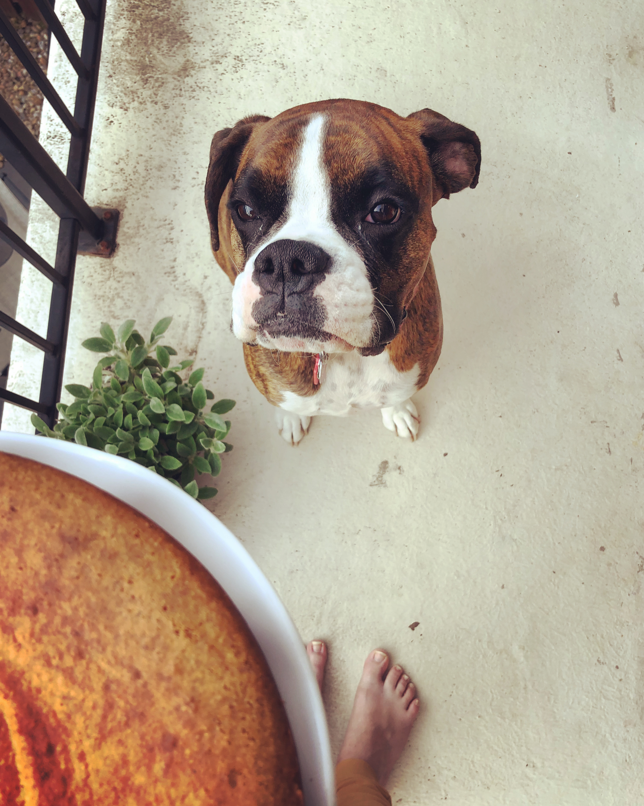

#### Welcome!

My name is Emily and I am a second-year MPH student in Population and Family Health at the Mailman School of Public Health at Columbia University.

I am currently a student in P8105 (Data Science 1). As a part of this course, I am building this website as I learn more about the world of data science and R.

You can learn more about my academic and professional experience on the "Experience" page.

Outside of who I am academically and professionally, I am an avid baker and runner, and I love to go on hikes with my best friend Rosie, pictured here.

